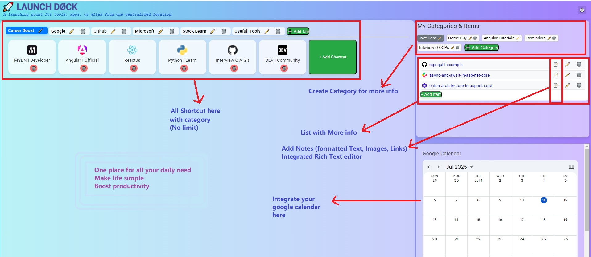

# 🚀🗂️ Launch Doc

**Launch Doc** is a sleek, modern dashboard web app designed to serve as a centralized launchpad for your frequently used tools, apps, and websites. It allows you to organize shortcuts under customizable tabs, export/import data, and personalize the interface with a clean UI.

> _“A launching point for tools, apps, or sites from one centralized location”_

---

### Add app as browser extension (Run project and add)
Follow article [Click here](https://infolink.hashnode.dev/steps-to-convert-an-angular-app-into-a-browser-extension)


### Add app as browser extension (download and add)
> This is angular project where you can clone and run on local
> If you are not aware about angular build/run and want to use extension to browser (Jiosphere/Chrome/Edge) directly then follow steps
#### Follow steps
- Download folder and save on your machine ➡️ [Click Here](https://github.com/nbbulbule/launchdock/blob/main/extension_Versions/LaunchDock_Extension%20V1.rar)
- Load as Chrome Extension
- Open Chrome
- Go to: chrome://extensions
- Enable Developer Mode (top right)
- Click “Load unpacked”
- Select downloaded folder from your machine
🎉 Now, every time you open a new tab, your Angular app will open.

## 🌟 Features
### 🔖 Tabs & Shortcuts
- Create, rename, delete, and reorder tabs via drag-and-drop (Angular CDK).
- Add shortcuts (URLs) to tabs with custom icons and titles.
- Drag-and-drop to reorder shortcuts within a tab.

### ⚙️ Settings Menu
- Toggle background gradient themes via a dropdown Settings menu.
- Easily extendable for additional customization options.

### 🗃️ Data Management
- Export your entire dashboard configuration (tabs and shortcuts) as a JSON file.
- Import a previously saved configuration file to restore your setup.

### 👤 User Profile
- Displays user avatar and name in the top-right corner.
- Ready for extension into full authentication.

---

## 🛠️ Tech Stack

- **Angular 17+**
- **Angular CDK DragDrop** for drag-and-drop functionality
- **HTML & SCSS** for styling
- **Local Storage** for persistent data
- **Responsive Design** – usable on desktop and mobile

---

## 📂 Project Structure
src/
├── app/

│ ├── components/

│ ├── models/

│ ├── services/

│ └── app.component.ts / html / scss

├── assets/

├── environments/

└── index.html

---

## 📸 Screenshots

| Tabs & Shortcuts | Settings Menu |
|------------------|---------------|
|  |  |

---

## 🚀 Getting Started

1. Clone the repo:

   ```bash
   git clone https://github.com/yourusername/launch-doc.git
   cd launch-doc

---

## Installation & Run
 ### Install Dependency
```npm install```

### Run the app
```ng serve```

### Visit http://localhost:4200

---

## ✨ Customization
To add more setting options (like font size, theme, etc.), extend the settings dropdown.

To persist user profiles, integrate with Firebase Auth or your preferred auth system.

---

## Steps to Google Services Integration (Calendar & Tasks):

This section of the application provides dedicated tabs for integrating Google Calendar and Google Tasks. Due to Google's security policies and the nature of embedding, direct full integration requires specific steps or API usage.

1. Google Calendar Integration
The "Calendar" tab in the Google Services section uses an <iframe> to embed your personal Google Calendar. For this to work, you need to obtain a special embed URL from your Google Calendar settings.

Steps to get your Personal Google Calendar Embed URL:

Open Google Calendar on your Desktop Computer:

Go to: https://calendar.google.com/

Ensure you are logged into the Google Account that owns the calendar you want to embed.

Access Calendar Settings:

On the left sidebar, find the section titled "My calendars". You might need to click the Menu icon (three horizontal lines ☰) in the top left corner to expand the sidebar if it's hidden.

Hover over the specific calendar you want to embed (e.g., your primary calendar, or a custom calendar where you manage events/tasks).

Click the three vertical dots (⋮) that appear next to the calendar name when you hover.

From the dropdown menu, select "Settings and sharing".

Locate "Integrate calendar":

On the left-hand menu within the settings, click on "Integrate calendar".

Customize and Get the Embed Code:

In the "Integrate calendar" section, you'll see an <iframe> embed code.

Crucially, below this embed code, click the "Customize" button. A new page or pop-up will open with customization options.

Configure Display Options:

On the left side of this customization tool, you'll see a list of your calendars under "Calendars to display". Ensure the checkbox next to your primary calendar (and any other calendars whose events you want to see) is ticked.

Note on Tasks: Google Tasks with due dates will appear on your main Google Calendar if your "Tasks" calendar is enabled for display in your regular Calendar view. The embed tool itself does not offer "Tasks" as a separate, distinct calendar to embed.

Adjust other settings like the Default View (e.g., "Day" for a daily view), width, height, colors, and navigation buttons as desired.

Copy the Updated src URL:

As you make changes, the <iframe> code at the very top of this customization page will update dynamically.

Copy only the URL within the src="..." attribute of this updated <iframe> code. It will be a long URL.

Paste into your Angular Component:

Open src/app/google-service/google-service.component.html.

Locate the <iframe> tag within the mat-tab label="Calendar".

Replace the placeholder src URL with the customized URL you just copied from Google Calendar.

<iframe
  src="PASTE_YOUR_LONG_CUSTOMIZED_GOOGLE_CALENDAR_EMBED_URL_HERE"
  style="border: 0"
  width="100%"
  height="300"
  frameborder="0"
  scrolling="no"
  title="Google Calendar Embed"
></iframe>

Save the file.

2. Google Tasks Integration
The "Tasks" tab provides a direct link to Google Tasks due to embedding limitations.

Explanation of Tasks Embedding:

Direct Embedding Limitations: Directly embedding the full, interactive Google Tasks interface (https://tasks.google.com/) into an <iframe> on external domains (like this application) is generally prevented by browser security policies (specifically, the X-Frame-Options or Content-Security-Policy headers set by Google). This is to prevent clickjacking and other security vulnerabilities.

API for Full Control: For a truly integrated and interactive Google Tasks experience (e.g., showing task lists, adding/editing tasks directly within the app), you would need to utilize the Google Tasks API. This involves:

Creating a project in the Google Cloud Platform.

Enabling the Google Tasks API.

Implementing OAuth 2.0 for user authentication and authorization.

Writing Angular code to make API calls to fetch, create, update, and delete tasks, then rendering them dynamically in your component. This is a significantly more complex development task.

Current Implementation:

The "Tasks" tab currently offers a convenient link to open Google Tasks in a new browser tab for quick access. This avoids the security limitations of iframes.

<a href="https://tasks.google.com/" target="_blank" class="google-action-button">Open Google Tasks</a>

---

## 🙌 Acknowledgements
Icons and emoji provided by:

[Twemoji](https://twemoji.twitter.com/)
[Heroicons](https://heroicons.com/)

---

## 🧠 Fun Fact
Built to reduce bookmark clutter and improve productivity by centralizing the launch of all your important tools ✨

---

## 📄 License
MIT © 2025 [launchdock]


