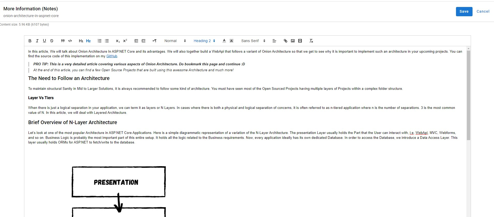

# 🚀🗂️ Launch Doc

**Launch Doc** is a sleek, modern dashboard web app designed to serve as a centralized launchpad for your frequently used tools, apps, and websites. It allows you to organize shortcuts under customizable tabs, export/import data, and personalize the interface with a clean UI.

> _“A launching point for tools, apps, or sites from one centralized location”_

---

### Add app as browser extension (Run project and add)
Follow article [Click here](https://infolink.hashnode.dev/steps-to-convert-an-angular-app-into-a-browser-extension)

### Add app as browser extension (download and add)
> This is angular project where you can clone and run on local
> If you are not aware about angular build/run and want to use extension to browser (Jiosphere/Chrome/Edge) directly then follow steps
#### Follow steps
- Download folder and save on your machine ➡️ [Click Here](https://github.com/nbbulbule/launchdock/blob/main/extension_Versions/LaunchDock_Extension_V5.rar)
- Load as Chrome Extension
- Open Chrome
- Go to: chrome://extensions
- Enable Developer Mode (top right)
- Click “Load unpacked”
- Select downloaded folder from your machine
🎉 Now, every time you open a new tab, your Angular app will open.

## 🌟 Features
### 🔖 Tabs & Shortcuts
- Create, rename, delete, and reorder tabs via drag-and-drop (Angular CDK).
- Add shortcuts (URLs) to tabs with custom icons and titles.
- Drag-and-drop to reorder shortcuts within a tab.

### ⚙️ Settings Menu
- Toggle background gradient themes via a dropdown Settings menu.
- Easily extendable for additional customization options.

### 🗃️ Data Management
- Export your entire dashboard configuration (tabs and shortcuts) as a JSON file.
- Import a previously saved configuration file to restore your setup.

### 👤 User Profile
- Displays user avatar and name in the top-right corner.
- Ready for extension into full authentication.

---

## 🛠️ Tech Stack

- **Angular 17+**
- **Angular CDK DragDrop** for drag-and-drop functionality
- **HTML & SCSS** for styling
- **Local Storage** for persistent data
- **Responsive Design** – usable on desktop and mobile

---

## 📂 Project Structure
src/
├── app/

│ ├── components/

│ ├── models/

│ ├── services/

│ └── app.component.ts / html / scss

├── assets/

├── environments/

└── index.html

---

## 📸 Screenshots

| Tabs & Shortcuts | Settings Menu | Notes/Info Popup  |
|------------------|---------------|--------------|
|  |  |  

---

## 🚀 Getting Started

1. Clone the repo:

   ```bash
   git clone https://github.com/yourusername/launch-doc.git
   cd launch-doc

---

## Installation & Run
 ### Install Dependency
```npm install```

### Run the app
```ng serve```

### Visit http://localhost:4200

## Build for Prod mode (to create extension file)

- run below command in vs code once project is opened
ng build --configuration=production

- after prod build paste below line in index.html (file in dist folder)
<link rel="stylesheet" href="./styles.css"> 

- for more details check below article (how to add extention to browser)
Follow article [Click here](https://infolink.hashnode.dev/steps-to-convert-an-angular-app-into-a-browser-extension)

---


## ✨ Customization
- To add more setting options (like font size, theme, etc.), extend the settings dropdown.

- To persist user profiles, integrate with Firebase Auth or your preferred auth system.

---

## Steps to Google Services Integration (Calendar & Tasks):

This section of the application provides dedicated tabs for integrating Google Calendar and Google Tasks. Due to Google's security policies and the nature of embedding, direct full integration requires specific steps or API usage.

### 1. Google Calendar Integration
- The "Calendar" tab in the Google Services section uses an <iframe> to embed your personal Google Calendar. For this to work, you need to obtain a special embed URL from your Google Calendar settings.

- Steps to get your Personal Google Calendar Embed URL:

- Open Google Calendar on your Desktop Computer:

- Go to: https://calendar.google.com/

- Ensure you are logged into the Google Account that owns the calendar you want to embed.

#### Access Calendar Settings:

- On the left sidebar, find the section titled "My calendars". You might need to click the Menu icon (three horizontal lines ☰) in the top left corner to expand the sidebar if it's hidden.

- Hover over the specific calendar you want to embed (e.g., your primary calendar, or a custom calendar where you manage events/tasks).

- Click the three vertical dots (⋮) that appear next to the calendar name when you hover.

- From the dropdown menu, select "Settings and sharing".

- Locate "Integrate calendar":

- On the left-hand menu within the settings, click on "Integrate calendar".

#### Customize and Get the Embed Code:

- In the "Integrate calendar" section, you'll see an <iframe> embed code.

- Crucially, below this embed code, click the "Customize" button. A new page or pop-up will open with customization options.

#### Configure Display Options:

- Note: keep default view as "schedule"

- On the left side of this customization tool, you'll see a list of your calendars under "Calendars to display". Ensure the checkbox next to your primary calendar (and any other calendars whose events you want to see) is ticked.

- Note on Tasks: Google Tasks with due dates will appear on your main Google Calendar if your "Tasks" calendar is enabled for display in your regular Calendar view. The embed tool itself does not offer "Tasks" as a separate, distinct calendar to embed.

- Adjust other settings like the Default View (e.g., "Day" for a daily view), width, height, colors, and navigation buttons as desired.

#### Copy the Updated src URL:

- As you make changes, the <iframe> code at the very top of this customization page will update dynamically.

- Copy only the URL within the src="..." attribute of this updated <iframe> code. It will be a long URL.

#### Paste into your Angular Component:

- Open src/app/google-service/google-service.component.html.

- Locate the <iframe> tag within the mat-tab label="Calendar".

- Replace the placeholder src URL with the customized URL you just copied from Google Calendar.

<iframe
  src="PASTE_YOUR_LONG_CUSTOMIZED_GOOGLE_CALENDAR_EMBED_URL_HERE"
   style="border-width:0" width="100%" height="400" frameborder="0" scrolling="no"
  title="Google Calendar Embed"></iframe>

#### Save the file.

---

## Step-by-Step: change localStorage to IndexDB for data storage (It will give better features like )

### Key Considerations for IndexedDB in a Browser Extension:
 - IndexedDB is Asynchronous: All operations (add, get, update, delete) are asynchronous. We'll use async/await for cleaner code.

 - Schema Definition: IndexedDB requires you to define your database name, version, and "object stores" (like tables in a relational database). We'll define one object store for categories.

 - Wrapper Library: While you can use the native IndexedDB API, it's quite verbose. For Angular, libraries like ngx-indexed-db or dexie.js simplify interactions greatly. I'll use ngx-indexed-db as it's Angular-specific.

 - Browser Extension Compatibility: IndexedDB works perfectly within browser extensions. No special permissions are usually needed beyond what's standard for a web application.

#### Step 1: Install ngx-indexed-db

```Bash```
npm install ngx-indexed-db

#### Step 2: Configure IndexedDB in src/app/app.config.ts

#### Step 3: Update src/app/app.component.ts

#### Step 4: Update src/app//services/app-config.service.ts

#### Step 5: Create src/app/services/indexdb.service.ts

#### Step 6: Update src/app/my-list/my-list.component.ts

#### Step 7: Update src/app/short-tab/short-tab.component.ts

## 🆚 LocalStorage vs IndexedDB – Full Comparison

| Feature                    | **LocalStorage**                             | **IndexedDB**                                       |
| -------------------------- | -------------------------------------------- | --------------------------------------------------- |
| **Storage Type**           | Key-value store (synchronous)                | NoSQL object store (asynchronous)                   |
| **Max Size Limit**         | \~5–10 MB per origin                         | 50 MB to several **GBs** (varies by browser & disk) |
| **Data Type Support**      | Strings only (JSON.stringify/parse required) | Full JS objects, binary, Blob, files                |
| **Access**                 | Synchronous (blocks UI for large ops)        | Asynchronous (non-blocking)                         |
| **Speed (for large data)** | Poor performance                             | High performance with large or structured data      |
| **Offline Support**        | Yes (until cleared)                          | Yes (until cleared)                                 |
| **Browser Support**        | All modern browsers                          | All modern browsers                                 |
| **Versioning Support**     | ❌ No                                         | ✅ Yes (schema versioning)                           |
| **Best Use Case**          | Small configs, flags, tokens                 | Offline caching, large data, structured storage     |
| **Security**               | Same-origin policy applies                   | Same-origin policy applies                          |


## 📊 Size Comparison in Popular Browsers (2025 Estimates)
### 1. 📦 LocalStorage Limits

| Browser                  | Per-Origin Quota   | Notes                                       |
| ------------------------ | ------------------ | ------------------------------------------- |
| **Chrome (Desktop)**     | \~5 MB             | Shared across tabs                          |
| **Edge (Chromium)**      | \~5 MB             | Similar to Chrome                           |
| **Firefox**              | \~10 MB            | Higher than Chrome                          |
| **Safari**               | \~5 MB             | Very strict and can clear on space pressure |
| **JioSphere / JioPages** | \~5 MB (estimated) | Based on Chromium WebView; likely 5 MB      |
| **Android WebView**      | \~5 MB             | Follows Chrome mobile behavior              |


⚠️ **Note:** LocalStorage limits are enforced strictly. If you go over the limit, you’ll get QuotaExceededError.

### 2. 🗃️ IndexedDB Limits

| Browser                  | Default Quota                                  | Notes                                                         |
| ------------------------ | ---------------------------------------------- | ------------------------------------------------------------- |
| **Chrome (Desktop)**     | Up to **6% of free disk space** or prompt user | Typically allows **100MB–2GB+**, depending on data and system |
| **Edge (Chromium)**      | Same as Chrome                                 | No special limits                                             |
| **Firefox**              | Up to 2GB or more                              | Based on available disk                                       |
| **Safari**               | \~50MB before prompt                           | User may get a dialog to allow more                           |
| **JioSphere / JioPages** | \~50MB–100MB (estimated)                       | Uses Chromium base, limited by WebView                        |
| **Android WebView**      | 6% of free space (same as Chrome Mobile)       | Behavior mimics Chrome on Android                             |


---

## 🙌 Acknowledgements
Icons and emoji provided by:

[Twemoji](https://twemoji.twitter.com/)
[Heroicons](https://heroicons.com/)

---
## Upgrade Angular version notes

- 1 Check current version compatibility
```bash```
npx ng update
- 2 Version by Version (like 17-> 18->19 -> 20, repeate multiple times for each versio nupgrade)
```bash```
npx ng update @angular/cli@18 @angular/core@18 @angular/cdk@18 @angular/material@18 --force
- 3 After update
```bash```
npm install
- 4 Save and test app
```bash```
npm run start
or 
```bash```
ng serve
- 5 Bonus: Upgrade other dependencies (optional)
After Angular upgrade, you can check for any remaining outdated packages:
```bash```
npx ng update
npm outdated
---

## 🧠 Fun Fact
Built to reduce bookmark clutter and improve productivity by centralizing the launch of all your important tools ✨

---

## 📄 License
MIT © 2025 [launchdock]


